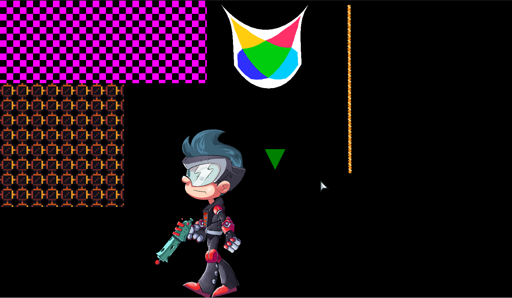

### A big testing project of every sprite in flixel that either uses drawTriangles or extends FlxStrip

##### flixel:
- FlxStrip

##### flixel-addons: 
- FlxSliceSprite (uses drawtriangles and extends FlxStrip)
- FlxSpine (uses FlxStrip in it's wrapper variable)
- FlxClothSprite (uses drawtriangles)
- FlxTiledSprite (extends FlxStrip)

##### flixel-ui:
nothing used drawTriangles or seemed to extend FlxStrip (at least, directly)

Output of `haxelib list` (Install all of these individually with haxelib or follow the steps below this list):
```cmd
actuate: [1.9.0]
box2d: [1.2.3]
flixel-addons: [3.0.0]
flixel-demos: [2.9.0]
flixel-templates: [2.6.6]
flixel-tools: [1.5.1]
flixel-ui: [2.5.0]
flixel: 5.0.2 [git]
hscript: [2.5.0]
hxcpp: [4.2.1]
layout: [1.2.1]
lime-samples: [7.0.0]
lime: [8.0.0]
openfl-samples: [8.7.0]
openfl: [9.2.0]
spinehaxe: [git]
systools: [1.1.0]
```

### Steps to set things up (using hmm: https://lib.haxe.org/p/hmm/)
Run the following commands:
- `haxelib --global install hmm`
- `hmm install`
- `haxelib run lime setup flixel`

To run the project enter the command
`lime test <platform>` where &lt;platform&gt; can be windows/mac/linux/html5 etc.

Output:
